# MSA Distributed Deadlock & Virtual Threads Demo

This project demonstrates the **"Distributed Deadlock"** phenomenon that occurs when synchronous I/O calls create a circular reference in a traditional **Thread Pool** environment. It serves as a comparative study to show how **Java 21+ Virtual Threads** can mitigate this issue without complex architectural changes.

## 🎯 Objective

To demonstrate and compare the concurrency models of:

1.  **Thread Pool Model (Platform Threads):** Demonstrates how limited thread resources combined with synchronous circular calls lead to **Thread Starvation** and system deadlock.
2.  **Virtual Thread Model (Project Loom):** Demonstrates how Virtual Threads prevent deadlock by unmounting during blocking I/O, maintaining high throughput even in circular dependency scenarios.

## 🏗️ The Scenario

Two services, `Server A` and `Server B`, synchronously call each other.

```mermaid
%%{init: { 'sequence': { 'actorMargin': 150, 'noteMargin': 10, 'boxMargin': 10 } } }%%
sequenceDiagram
    autonumber
    participant Users as Clients
    participant ServerA as Server A
    participant ServerB as Server B

    %% 1. 상황 발생
    rect rgb(240, 248, 255)
        Note over Users, ServerA: ⚡ Burst Requests (N)
        Users->>ServerA: Requests (1 ... N)
    end

    Note right of ServerA: 🔒 Pool Full (N/N)<br/>(Waiting for ServerB)

    %% 2. A가 B를 필요로 함 (Dependency 1)
    rect rgb(255, 245, 245)
        Note over ServerA, ServerB: 👉 1. Server A needs Server B
        ServerA->>ServerB: Sync Calls (1 ... N)
    end
    
    Note right of ServerB: Processing...

    %% 3. B가 A를 필요로 함 (Dependency 2 - Circular)
    rect rgb(255, 230, 230)
        Note over ServerA, ServerB: 👈 2. Server B needs Server A
        ServerB->>ServerA: Recursive Calls (1 ... N)
    end

    Note right of ServerA: 🚫 BLOCKED<br/>(0 Threads Left)
    
    Note over ServerA, ServerB: 💥 DEADLOCK (Mutual Waiting)
```



### 1. The Problem: Thread Pool Hell
* **Condition:** Fixed thread pool size (e.g., `server.tomcat.threads.max=1`).
* **Result:** `Server A` holds a thread waiting for `Server B`. `Server B` requests `Server A`, but `Server A` has no available threads to process the incoming request because they are all waiting. The system hangs due to resource starvation.

### 2. The Solution: Virtual Threads
* **Condition:** Virtual Threads enabled (`spring.threads.virtual.enabled=true`).
* **Result:** When `Server A` blocks on I/O, the virtual thread yields the carrier (OS) thread. The OS thread is free to process the incoming request from `Server B`. The circular dependency is resolved without deadlock.

---

## 🚀 How to Run Tests

This project uses **Docker** to containerize the services and **Gradle** to run End-to-End (E2E) tests.

### Quick Start (From Clean State)
Run the following command to clean, build the images, and run the tests in one go:

```bash
./gradlew clean bootJar && \
docker build -t server-a:latest server-a/ && \
docker build -t server-b:latest server-b/ && \
./gradlew :e2e-tests:test
```

### Step by Step Instructions

If you prefer to run each step manually:

**1. Clean build artifacts and remove old Docker images**
```bash
./gradlew clean
docker rmi server-a:latest server-b:latest
```

**2. Build JAR files**
```bash
./gradlew bootJar
```

**3. Build Docker images**
*Note: The Docker build relies on the JAR files created in the previous step.*
```bash
docker build -t server-a:latest server-a/
docker build -t server-b:latest server-b/
```

**4. Run E2E tests**
```bash
./gradlew :e2e-tests:test
```

### ⚠️ Notes
-   **Gradle** is used to build the executable JAR files.
-   **Docker** is used to build container images (`server-a` and `server-b`).
-   The E2E tests require the Docker images to exist locally before execution.

---

## ⚙️ Configuration Details

You can observe the behavior by tweaking the `application.yml` properties in the respective services:

**To Reproduce Deadlock (Platform Threads):**
```yaml
server:
  tomcat:
    threads:
      max: 1 # Simulates resource exhaustion
spring:
  threads:
    virtual:
      enabled: false
```

**To Solve with Virtual Threads:**
```yaml
server:
  tomcat:
    threads:
      max: 200 # Ignored or irrelevant for blocking behavior in VT
spring:
  threads:
    virtual:
      enabled: true
```
